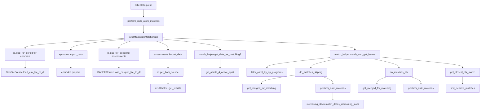

# NADATools_AzFunc

- Automation tools for validation and generation of files for upload to NADAbase

# Data/Code flow

# Development setup

- before debuging a function app, run azurite
- assuming azuite is instlled globally on the system rnun

- to run : azurite -s -l c:\azurite -d c:\azurite\debug.log
- see the vscode extension for more details

## requiremetns.txt development dependency

- -e C:\\Users\\aftab.jalal\\dev\\assessment_episode_matcher
otherwise 
assessment_episode_matcher==0.6.7

## Pushing to cloud

Staging slot is now deployed vi github actions - just push to main branch

- Old Way: Open the VsCode Azure Extn and Expand - Function App> nada-tools-directions-slots
  right click on staging and deploy
  in the context menu that pop-up on the top , select the nada-tools-functions-staging option

  if not using the azure extension then:
  func azure functionapp publish nada-tools-directions --build remote

  Old way : Pushing to staging SLOT :
  func azure functionapp publish nada-tools-directions --build remote --slot staging

## Open telemetry

[OpenTelementry](https://github.com/Azure/azure-sdk-for-python/tree/main/sdk/monitor/azure-monitor-opentelemetry/samples/logging)

## Git
pushing : git push origin main 
git remote -v 
 has PAT embedded in the url

 not using wincred
 git config --global --unset user.name
  git config --global --unset user.email