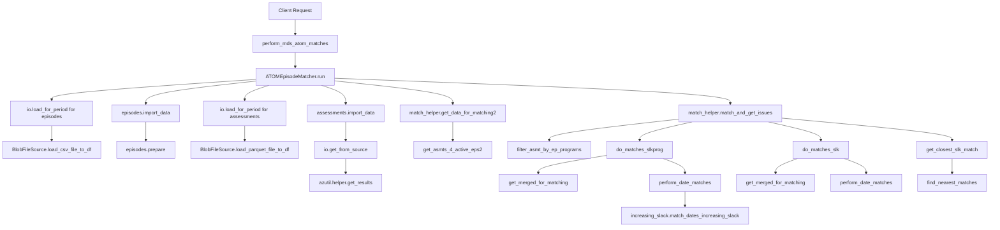

# NADATools_AzFunc Architecture Documentation

## Overview

NADATools_AzFunc is an Azure Functions application designed to automate the validation and generation of files for upload to NADAbase. The primary purpose is to process and match ATOM (assessment) data with MDS (episode) data, and generate the required survey.txt file for NADAbase submissions.

## System Architecture

The application is structured as a set of Azure Functions exposed as HTTP endpoints:

1. `/match` - Matches MDS (episode) data with ATOM (assessment) data
2. `/surveytxt` - Generates the survey.txt file for NADAbase based on matched data
3. `/base` - A simple test endpoint

## Key Components

### 1. Data Sources

- **MDS Data**: Episode data stored in CSV/Excel format in blob storage
- **ATOM Data**: Assessment data stored in Parquet format in blob storage
- **Configuration**: Stored in configuration.json in blob storage

### 2. Core Modules

- **function_app.py**: Main entry point that defines the HTTP endpoints
- **matching_helper.py**: Handles the matching of MDS and ATOM data
- **nada_helper.py**: Processes matched data to generate the NADAbase survey.txt format
- **utils/io.py**: Provides file I/O operations for blob storage
- **utils/log_telemetry.py**: Handles logging and telemetry

### 3. External Dependencies

- **assessment_episode_matcher**: A custom package (likely developed in-house) that provides the core functionality for matching assessments to episodes and processing data for NADA format

## Data Flow

### Episode-Assessment Matching Process



### Survey.txt Generation Process

1. Client calls `/surveytxt` with date range parameters
2. `nada_helper.run()` is invoked
3. Configuration is loaded from blob storage
4. Matched assessment data is retrieved for the specified period
5. `generate_nada_export()` processes the data using `prep_nada_fields()`
6. The final survey.txt file is generated using `nada_df_generator.generate_finaloutput_df()`
7. The file is saved to blob storage

## Configuration

The application uses configuration.json which contains:

- **drug_categories**: Maps drug names to categories (e.g., "Nicotine" category includes the substance "Nicotine")
- **EstablishmentID_Program**: Maps establishment IDs to program codes
- **purpose_programs**: Defines which programs are included for NADA exports
- **table_config**: Defines the fields and filters for ATOM and MDS data

## Development and Deployment

### Local Development

- Azure Functions core tools with VS Code is used for local development
- Azurite is used to emulate Azure Storage locally
- Configuration via local.settings.json files (multiple versions for different environments)

### Deployment

Currently this function app is run locally only. If deployment to Azure is needed:

- The `assessment_episode_matcher` dependency is installed from GitHub via `git+https://` in `requirements.txt`. If the repo is **private**, Azure Functions won't be able to pull it during `--build remote`. Options:
  1. Make the `assessment_episode_matcher` repo public
  2. Publish the package to a private PyPI feed (e.g. Azure Artifacts) and update `requirements.txt` to use a pinned version (e.g. `assessment_episode_matcher==0.7.2`)
  3. Vendor the package into the repo (not recommended)
- GitHub Actions deploys to staging slot on push to main branch
- Manual deployment option via Azure Functions Core Tools:
  ```
  func azure functionapp publish nada-tools-directions --build remote
  ```

## Drug Information Handling

The system processes drug information from SurveyJS forms, with recent changes to support both old and new formats:

- The old format used separate PDC (Primary Drug of Concern) and ODC (Other Drugs of Concern)
- The new format (post July 1, 2025) uses a unified "DrugsOfConcernDetails" structure
- "Nicotine" is defined as a drug category that covers both cigarette smoking and vaping

The assessment_episode_matcher package handles the transformation of both formats into the required NADA output format.

## Critical Files

- **function_app.py**: Entry point defining HTTP endpoints
- **matching_helper.py**: Core matching logic
- **nada_helper.py**: Survey.txt generation logic
- **configuration.json**: System configuration
- **local.settings.json**: Environment-specific settings

## Error Handling and Logging

- Errors during matching and processing are captured and returned in the HTTP response
- Warnings (particularly for AOD - Alcohol and Other Drugs) are saved to a separate file
- Telemetry is configured to capture detailed logs